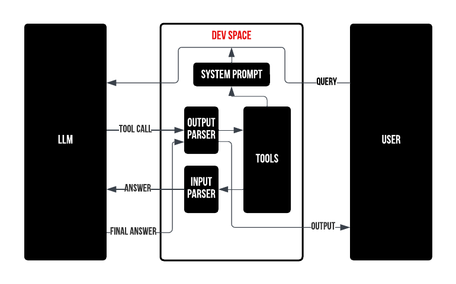
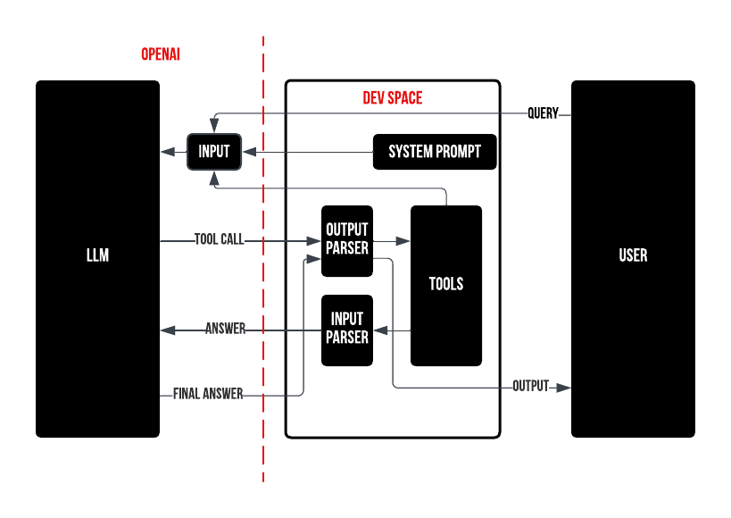

# Agents

A little more about agents:

Since basic LLMs can take nothing but text as input and also output nothing but text back, we have to take care of everything else ourselves.

### Or do we?

There are several agentic frameworks:
- [LangChain](https://github.com/langchain-ai/langchain)
- [SmolAgents](https://github.com/huggingface/smolagents)
- [Haystack](https://github.com/deepset-ai/haystack)

that allow us to set up an agent within a few lines of code. So why would we want to do it ourselves? These frameworks provide very simple objects that completely abstract away and hide all the complexities of what goes on behind the scenes. When these out-of-the-box solutions don't work properly for your use case, it is often very difficult to manually dissect them yourself and find what's wrong. It is doubly difficult when you don't understand what actually goes on in the innards of an agent.

To use LLM in our user-facing product we need to:
* (optional) Define a system prompt
* Format the user query with our system prompt into model input
* Send back the response to the user

To make an agent we need to:
* Define a system prompt
* Define our tools
* Insert the tools' description into the system prompt
* Define the syntax of tool calling
* Parse the model's output
* Perform the tool calls ourselves
    * The model does not call any function itself
* Control the agent's workflow
* Send back the final response to the user
    

What we are actually going to do in this workshop:

To make an agent we need to:
* <strike>Define a system prompt</strike>
* Define our tools
* <strike>Insert the tools' description into the system prompt</strike>
* <strike>Define the syntax of tool calling</strike>
* Parse the model's output
* Perform the tool calls ourselves
    * The model does not call any function itself!
* Control the agent's workflow
* Send back the final response to the user

We are going to use the OpenAI API for our agent. In the OpenAI API framework, the strikethrough points are done on the server (LLM) side of the equation and since we are using OpenAI's own models for our demo, OpenAI will do this for us.

