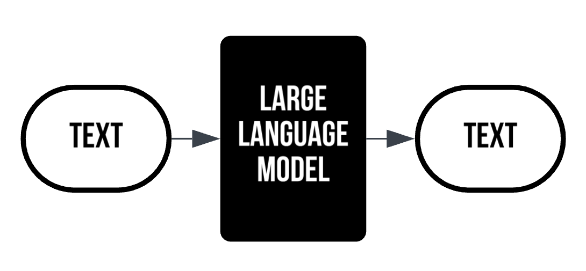
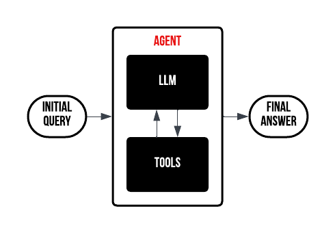

# Introduction to Agents

First a litte bit of theory...

## What's a LLM

A large language model (LLM) is an advanced type of artificial intelligence designed to understand and generate human-like text. Built using deep learning techniques—particularly transformer architectures—LLMs learn from vast datasets by breaking text down into tokens and creating numerical embeddings that capture semantic meaning. This process enables the model to recognize patterns and context in language, allowing it to produce coherent, contextually relevant responses to a wide range of queries.

In practical applications, LLMs are used for tasks such as text completion, translation, summarization, and interactive dialogue. Python programmers often leverage these models through various machine learning frameworks, and they can further enhance performance by fine-tuning a pre-trained model on domain-specific data. The careful adjustment of hyperparameters during training and fine-tuning is crucial, as these settings influence how the model learns and performs, ensuring optimal outcomes for different applications.

## What is an agent?

It’s important to note that LLMs process only text as input and output. Agents built on top of these models take this text-centric approach and extend it by incorporating additional layers of reasoning, memory, and decision-making. By interpreting textual prompts, agents can decide on multi-step actions, interact with external APIs, or access databases—all while keeping the language model’s text-based nature at their core.

These agents bridge the gap between simple text generation and complex task execution. They leverage the rich understanding provided by LLMs and integrate external tools and control mechanisms to perform tasks like scheduling, data retrieval, or even controlling software systems. This integration transforms the straightforward text responses of LLMs into dynamic, interactive systems capable of addressing real-world problems with greater autonomy and precision.

And we will built one ourselves..
